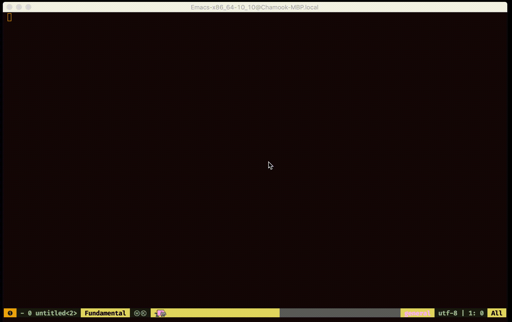

# Emacs Giphy

Did you ever want to add a fancy gif to some markdown, but also were feeling
_really_ lazy?

This handy function grabs a random gif from [giphy](https://giphy.com/) for a
given keyword and puts it into a markdown snippet on the kill-ring - so you
can handily paste it wherever.



## Installation

- clone this repo somewhere
- set the [`giphy-api-key`](https://github.com/chamook/emacs-giphy/blob/master/giphy.el#L7) value to an [actual api key](https://developers.giphy.com/docs/api#quick-start-guide)
- load the file on startup in your config:

```elisp
(load "~/emacs-custom/giphy.el")
```
